## 소개
- 이 글은 단지 CS231n를 공부하고 정리하기 위한 글입니다.
- Machine Learning과 Deep Learning에 대한 지식이 없는 초보입니다.
- 내용에 오류가 있는 부분이 있다면 조언 및 지적 언제든 환영입니다!

---
  

## 참조
- [CS231n Lecture 4. 유튜브 강의](https://www.youtube.com/watch?v=d14TUNcbn1k&list=PL3FW7Lu3i5JvHM8ljYj-zLfQRF3EO8sYv&index=4)

- [Cs231n Lecture 4. 강의 노트](http://cs231n.stanford.edu/slides/2017/cs231n_2017_lecture4.pdf)

- [CS231 Lecture 4. 한국어 자막](https://github.com/visionNoob/CS231N_17_KOR_SUB/blob/master/kor/Lecture%204%20%20%20Introduction%20to%20Neural%20Networks.ko.srt)

- [https://cding.tistory.com/4?category=670644](https://cding.tistory.com/4?category=670644)

- [https://wonsang0514.tistory.com/18?category=813399](https://wonsang0514.tistory.com/18?category=813399)

- [https://leechamin.tistory.com/86?category=830805](https://leechamin.tistory.com/86?category=830805)

- [https://zzsza.github.io/data/2018/05/13/cs231n-backpropagation-and-neural-networks/](https://zzsza.github.io/data/2018/05/13/cs231n-backpropagation-and-neural-networks/)

---
  

## 개요
### < Loss Functions and Optimization >
0. [Reminder Previous Lecture](#reminder-previous-lecture)
1. [Loss Function](#loss-function)
    1. [Multiclass SVM loss](#multiclass-svm-loss)
    2. [Regularization](#regularization)
    3. [Softmax Classifier](#softmax-classifier)
2. [Optimization](#optimization)
    1. [Random search 임의 탐색](#random-search-임의-탐색)
    2. [local geometry 경사 하강법](#local-geometry-경사-하강법)
    3. [Stochastic Gradient Descent](#stochastic-gradient-descent)
3. [특징변환](#특징변환)
    1. [컬러 히스토그램](#컬러-히스토그램)
    2. [Histogram of Oriented Gradient](#histogram-of-oriented-gradient)
    3. [Bag of Words](#bag-of-words)
4. [결론](#결론)

---

## Computational graphs

앞서서 Linear Classification에 사용하는 weight 값을 평가하기 위한 `loss function`,

그리고 weight 값의 최적화를 위한 Gradient Descent(경사 하강법)과 같은 `Optimization` 기법에 대해서 배웠습니다.

이제 하나의 Linear Classification이 아니라 여러 개를 사용할 경우 `Gradient` 값을 어떻게 찾을 지에 대해서 배웁니다.

먼저 이를 배우기 전에 우리가 앞서서 배운 내용들을 아래와 같이 `Computational Graphs` 형태로 표현할 수 있습니다.

Computational Graphs로 표현하면 `input` 값과 `local gradient`값을 쉽게 파악할 수 있습니다.

또한 복잡한 형태의 `Anaytic gradient`를 보다 쉽게 계산해 낼 수 있습니다.

  

## Backpropagation

이제 우리는 Backpropagation (역전파법)에 대해서 배울 것입니다.

이 기법에서는 `Chain Rule`를 이용하여 Backpropagation를 구할 수 있습니다.

아래에 간단한 예시를 봅시다.

먼저 `q=x+y` 와 `f=qz`와 같이 한 `Computation Node`에 대해서 국소적으로 봅시다.

이러한 국소적 상황에서는 다음과 같이 보다 쉽게 `Gradient`값을 각각 구할 수 있습니다.

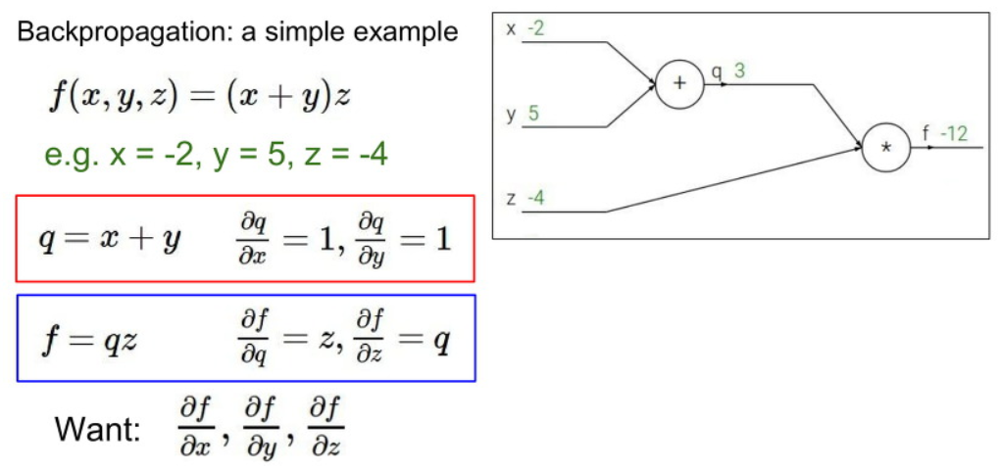
  

이제 뒤에서 부터 차례대로 Gradient 값을 구해봅시다.

마지막값은 Gradient 값은 1입니다.

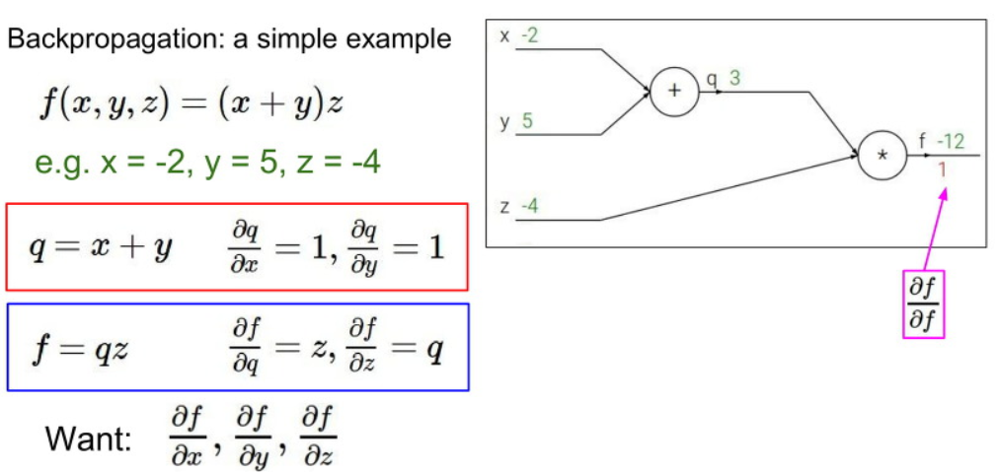

다음으로 z값에 대한 Gradient 값은 `q`값인 것을 볼 수 있습니다.

따라서 답은 `q=3`의 값을 가지는 것을 볼 수 있습니다.

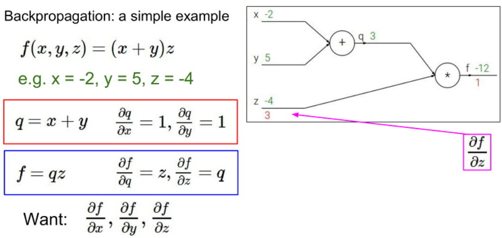

다음 q값에 대한 Gradient 값은 `z`값인 것을 볼 수 있습니다.

따라서 답은 `z=-4` 값을 가지는 것을 볼 수 있습니다.

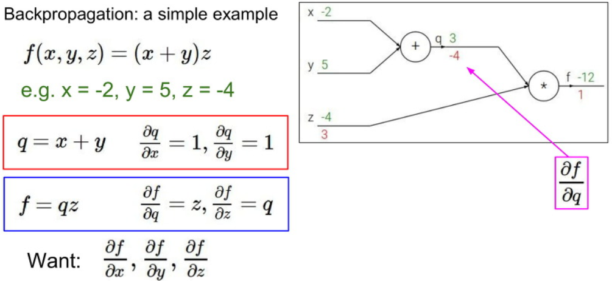

이제 x와 y에 대한 값을 계산하기 위해서 앞에서 계산한 Gradient 값과 현재 local Gradient 간에

`Chain Rule`를 적용하여 계산해봅시다.

결과적으로 q값에 대한 f의 Gradient와 y값에 대한 q의 Gradient를 곱하면

`-4 * 1 = -4`

그림에는 없지만 x값 또한 `-4 * 1 = -4`를 가진다는 것을 Backpropagation (역전파법)을 이용하여 유추할 수 있습니다.

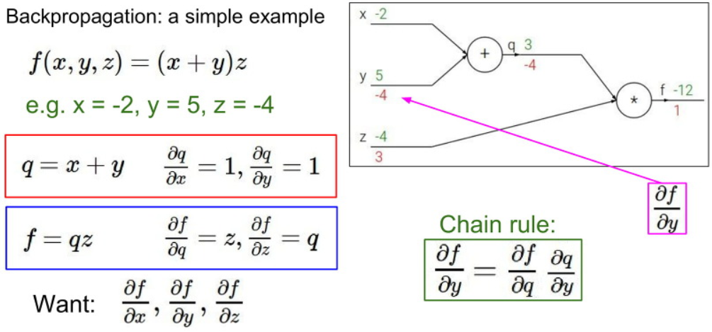

자 위 설명을 좀더 보기 쉽게 그림으로 설명해 보겠습니다.

우선 `x`와 `y`값을 `입력`으로 받고 `f`라는 함수에 집어넣어서 `z` 라는 값을 얻어냅니다.

이때 우리는 z를 x로 미분한 값과 z를 y로 미분한 값을 얻어낼 수 있습니다.

이를 local gradient 값이라고 합니다.

이제 z를 끝으로 L, 즉 loss를 계산했다고 합시다.

우리는 먼저 마지막에서 부터 L를 z로 먼저 미분합니다.

다음 L를 x, y로 미분한 값을 구할 때면, 아까 구해놨던 z를 x, y로 미분한 값과 L를 z로 미분한 값을 곱하는 `Chain rule`를 이용하여 구할 수 있습니다.

이렇게 입력을 받고 loss값을 구하는 계산 과정을 `forward pass`라고 하고,

`forward pass`가 끝난 이후 역으로 미분해가며 기울기 값을 구해가는 과정은 `backward pass`라고 부릅니다.

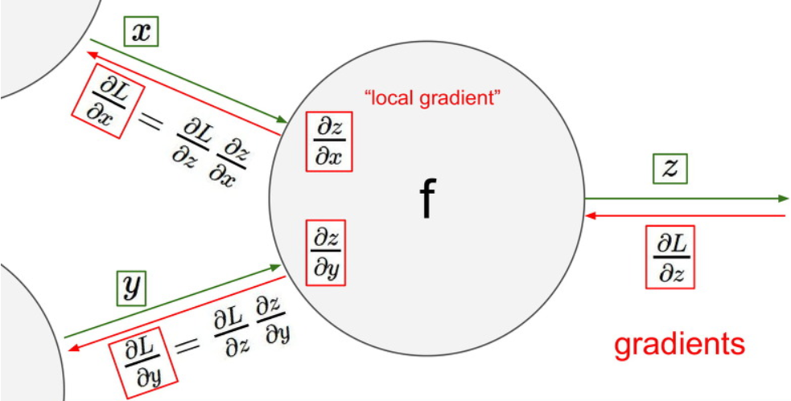

자 이제 좀 복잡한 예시를 봅시다.

이 예시는 자세하게 설명하지 않겠습니다.

아래와 같이 각각에 local gradient 값을 미리 구하고, 전에 있던 input 값을 이용하여

뒤에서부터 backpropagation를 한 결과 값입니다.

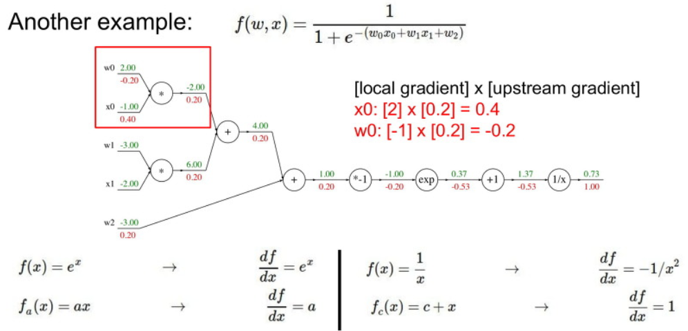

여기서 중요하게 보아야 할 부분은 아래의 파란색 박스 부분입니다.

이 게이트의 연산 부분은 sigmoid 함수와 같은 형태입니다.

이러한 sigmoid 함수의 미분 결과는 `(1-sigmoid(x)) * sigmoid(x)` 와 같은 형태를 가집니다.

이를 이용하여 여러 과정을 skip하고 간단하게 계산 할 수 있습니다.

아래의 예시 같은 경우 sigmoid(x)의 출력값인 `0.73`를 이용하여

`loss = (1-0.73) * 0.73 = 0.2` 의 값을 가지는 것을 볼 수 있습니다.

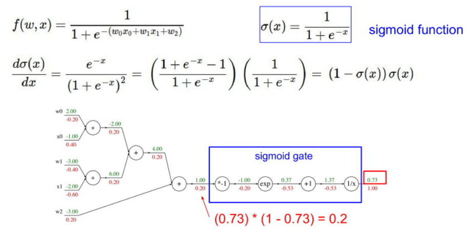

그리고 Backpropagation을 하면서 자주 보일 패턴입니다.
`add gate`는 덧셈 `+`,
`max gate`는 최대값을,
`mul gate`는 곱셈 `x`를 구하는 gate 입니다.

이는 backward pass를 할때에는 조금더 간단하게 계산이 가능합니다.

- `add gate` : 이미 가지고 있던 gradient를 각각의 노드의 `분배`해주면 됩니다.
- `max gate` : `더 큰 쪽에만 gradient를 전달`하고 `작은 쪽은 0값`을 줍니다.
- `mul gate` : 현재의 gradient를 `각각 숫자에 곱해서 바꿔치기` 해주면 됩니다.

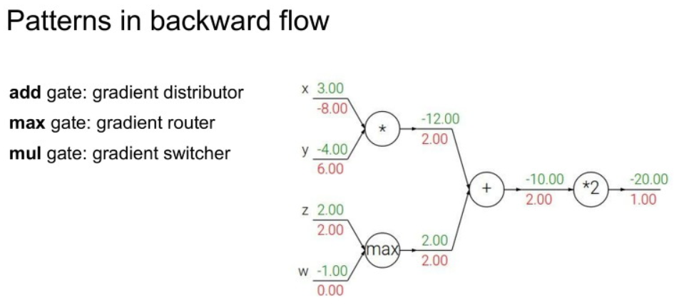

아래와 같이 노드 하나에서 다른 노드 두개로 이어졌을 때, backpropagation을 수행할 때

저 `뒤의 두개의 노드에서 오는 미분 값을 더한 값`이 됩니다.

반대로 앞의 노드 하나만 바뀌어도 뒤의 노드 두 개가 모두 바뀐다는 사실을 알아두시면 좋습니다.

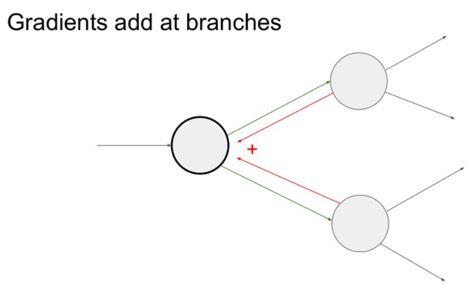

## Gradient for vectorized code

자 앞에서 한 내용들은 어떤 한 변수 값으로 Gradient을 계산했습니다.

하지만 우리가 실제로 사용하는 입력값은 `scaler` 값 이 아닌 `vector`값 입니다.

이러한 vector를 사용하기 위해서는 `다변수 벡터 함수(vector-valued function of multiple variables)` 에 대한 일차미분값이 필요하다.

이를 Jacobian (야코비안) matrix 라고 한다.

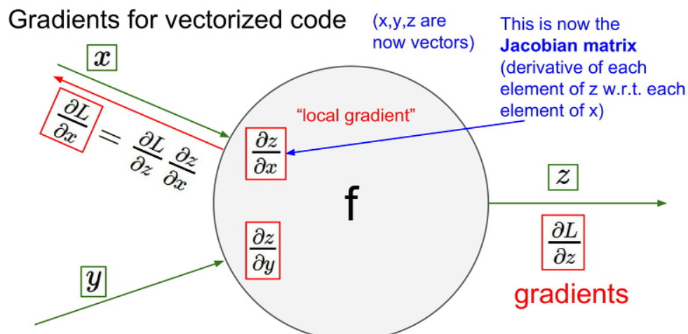

자 예시로 4096-d 의 input matrix와 같은 경우, Jacobian matrix를 `4096 x 4096`의 크기를 가집니다.

여기서 minibatch를 100이라고 한다면 Jacobian matrix의 크기는 어떻게 될까요

`409600 x 409600`의 크기를 가집니다. 굉장히 크죠...

여기서는 `Jacobian matrix` 가 `input matrix의 길이를 변으로 가지는 정방형 행렬`임을 알고 넘어가면 됩니다.

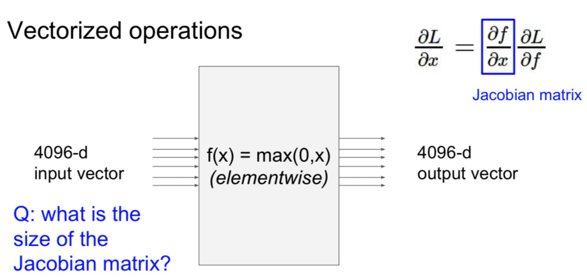

아래에는 벡터 입력에 대한 Gradient 값을 구하는 과정을 보여줍니다.

먼저 Linear Classifier 이후에 L2 Regularization으로 loss를 사용한다고하자.

이때에 L2에 입력 `q=Wx`라고 할때, `L2의 Gradient 값은 2q`임을 알수 있다.

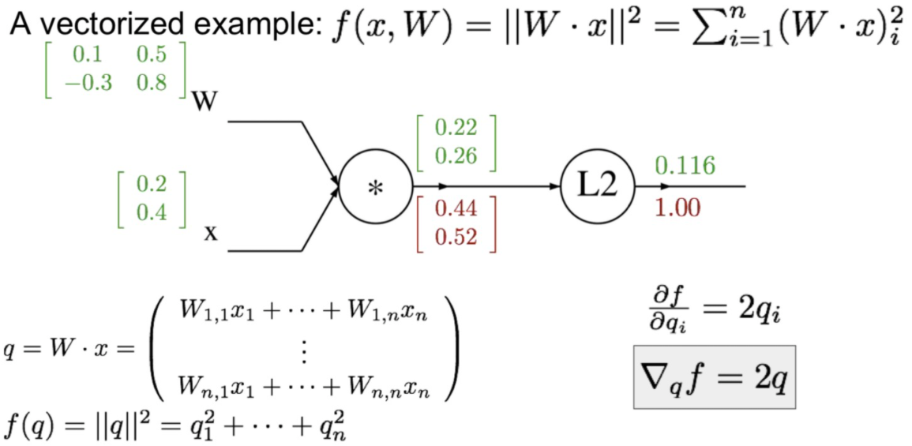

이후에 W에 대한 Jacobian matrix 값과 앞에서 L2에 대해 계산한 결과를 Chain rule를 이용하여 계산합시다.

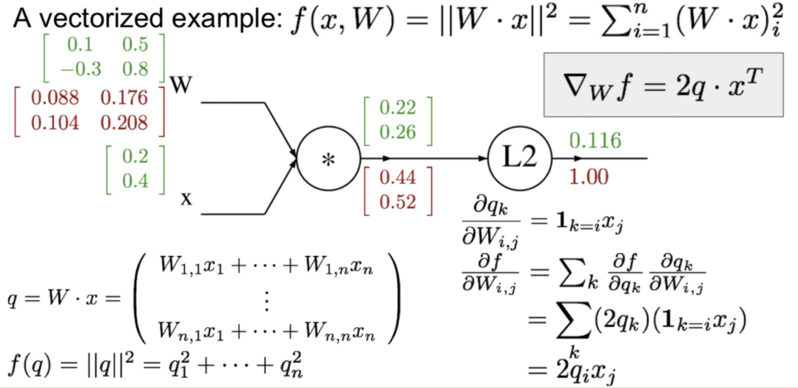

마지막으로 입력 X에 대한 Jacobian matrix에 대해서 앞에 과정을 반복하여 계산합시다.

이러한 과정으로 vector에 대한 Backpropagation 진행과정을 볼 수 있었습니다.

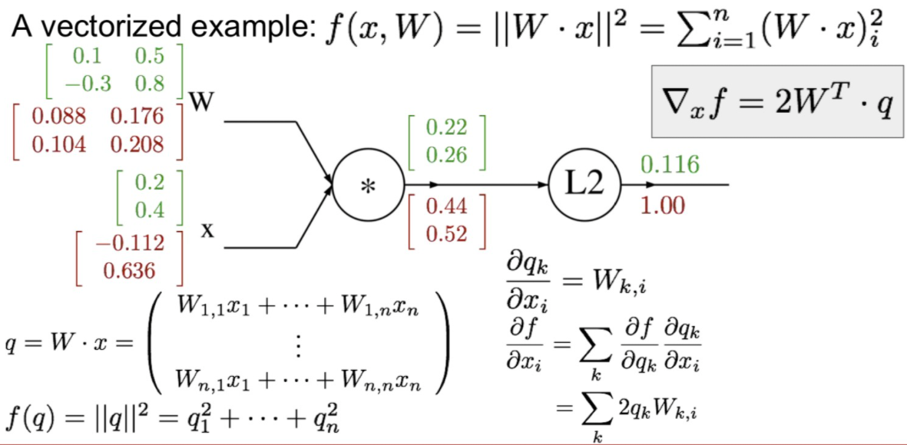

이제 위에서 배운 Backpropagation를 코드로 구현해봅시다.

먼저 Forward pass에서는 노드의 출력을 계산하는 함수를 구현하고

Backward pass에서는 gradient를 계산합니다.

여기서 `Forward의 값(연산 결과)은 이후에 Backward pass에서 사용하기에 저장해야합니다.`

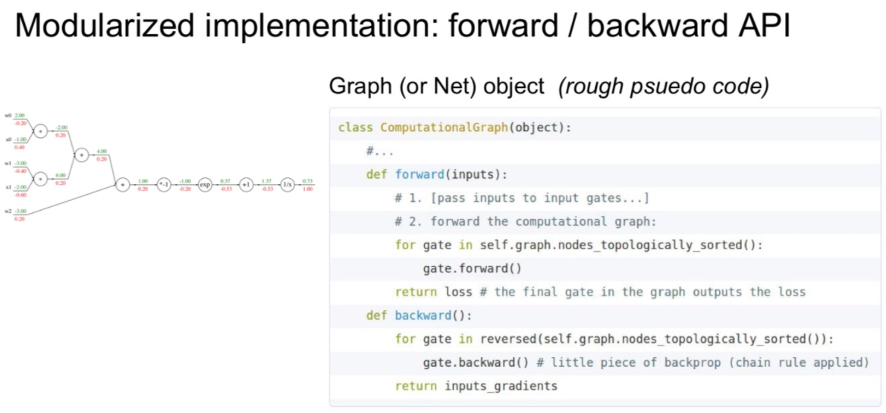

## Neural Networks

Neural Networks (인공 신경망)는 앞에서 배운 Linear Classifier을 2개 이상 쌓아올리는 형태이다.

여기서 중요한 부분은 이 사이에 Non-linear function를 사용해야 한다는 점이다.

아래의 예시를 살펴보자. 아래에는 3072개의 입력 x와 W1과 linear classification 결과로 100개의 h 값을 계산한 뒤에

이 값에 Non-linear max 함수를 취한 뒤에 W2값을 linear classification으로 사용하요 10개의 결과 가지는 것을 볼 수 있습니다.

이러한 과정은 기존에는 선형 레이어 하나만 쌓아서 빨간색 자동차만을 찾았다면,

Neural Networks를 이용하면 빨간색, 노란색 자동차와 같이 여러 색깔을 찾을 수 있는 모델을 구축하였습니다.

이러한 방법으로 레이어를 쌓아가면서 `여러 특징을 추출 할 수 있다`는 것을 확인하였습니다.

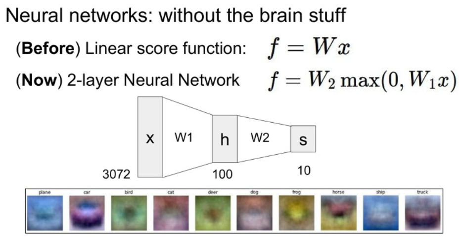

아래와 같이 Neural Network을 2개뿐 아니라 3개 이상으로 구성할 수 있다.

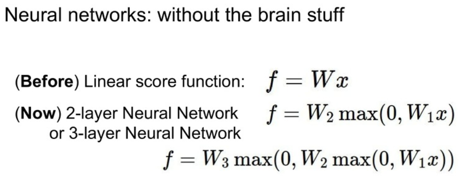

아래 그림과 같이 Neural network는 `뉴런의 구조`와 `Computation Graph의 구조의 유사성`을 따온 구조이다.

하지만 실제의 뉴런 구조와 같다고 생각하면 오산이다.

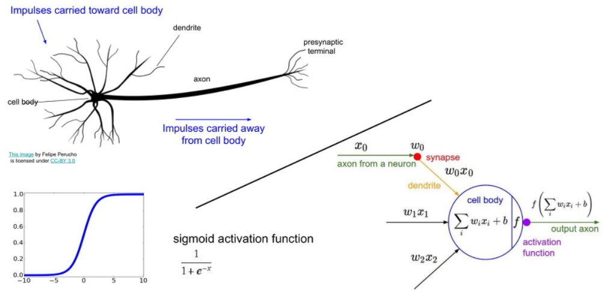

위 그림과 같이 중간중간에 모든 노드가 다음의 모든 노드에 영향을 끼치는 레이어를 `fully-connected layer`라고 합니다.

아래의 Neural Networks의 예에서도, 모든 W값들이 다음 값들에 영향을 미쳤으니 `fully-connected layer`라고 볼 수 있습니다.

아래에서 2-layer개에는 hidden layer가 1개, 3-layer에는 hidden layer가 2개 이므로,

각각 1-hidden-layer 인공신경망, 2-hidden-layer 인공신경망이라고 불린다고합니다.

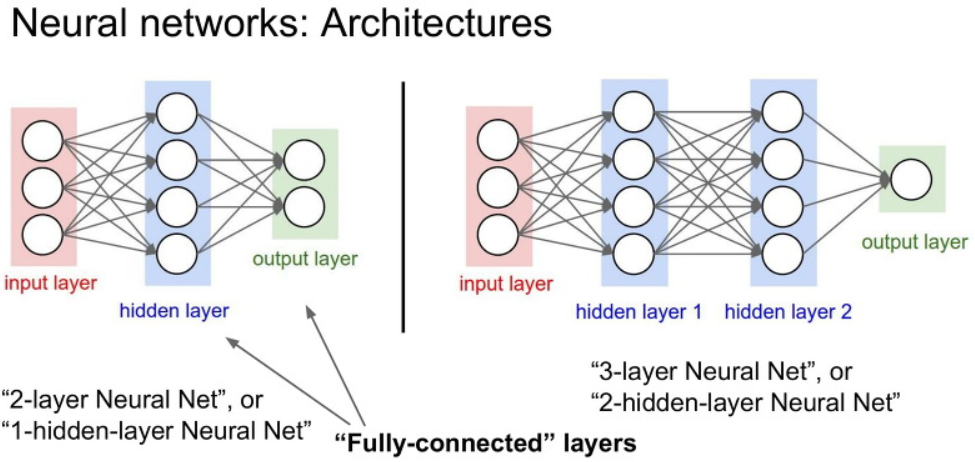

자 다음 강의에서는 CNN에 대해서 알아보도록하겠습니다.
