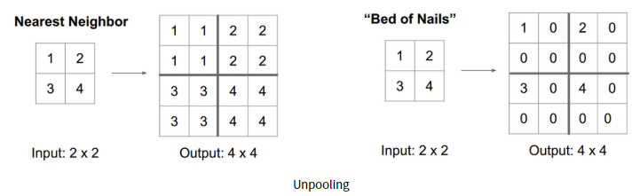
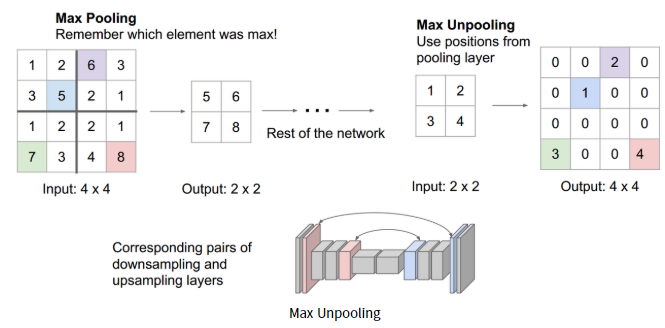
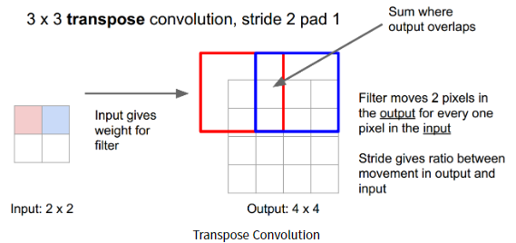
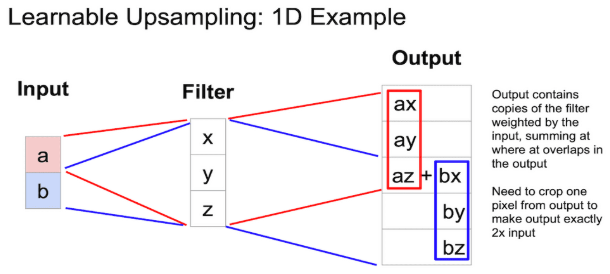
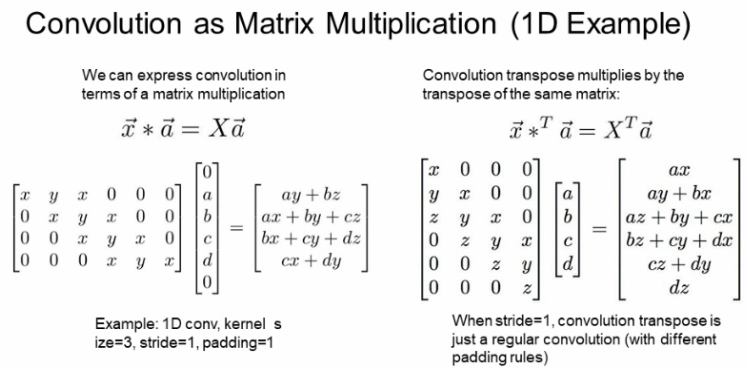
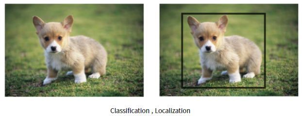
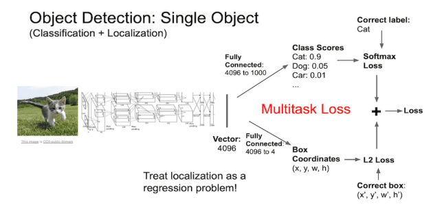

## 소개
- 이 글은 단지 CS231n를 공부하고 정리하기 위한 글입니다.
- Machine Learning과 Deep Learning에 대한 지식이 없는 초보입니다.
- 내용에 오류가 있는 부분이 있다면 조언 및 지적 언제든 환영입니다!

---
  

## 참조
- [CS231n 2017 Lecture 11. 유튜브 강의](https://www.youtube.com/watch?v=nDPWywWRIRo&ab_channel=StanfordUniversitySchoolofEngineering)

- [CS231n 2017 Lecture 11. 강의 노트](http://cs231n.stanford.edu/slides/2017/cs231n_2017_lecture11.pdf)

- [CS231n 2020 Lecture 12. 강의 노트](http://cs231n.stanford.edu/slides/2020/lecture_12.pdf)

- [CS231 Lecture 12. 한국어 자막](https://github.com/visionNoob/CS231N_17_KOR_SUB/blob/master/kor/Lecture%2011%20%20%20Detection%20and%20Segmentation.ko.srt)

- [https://leechamin.tistory.com/112](https://leechamin.tistory.com/112)

- [https://wordbe.tistory.com/entry/cs231n-12-Object-detection-Segmentation](https://wordbe.tistory.com/entry/cs231n-12-Object-detection-Segmentation)

- [https://lsjsj92.tistory.com/416](https://lsjsj92.tistory.com/416)

- [https://devkor.tistory.com/entry/CS231n-11-Detection-and-Segmentation](https://devkor.tistory.com/entry/CS231n-11-Detection-and-Segmentation)

- [https://m.blog.naver.com/wpxkxmfpdls/221878233486](https://m.blog.naver.com/wpxkxmfpdls/221878233486)

- [https://younghk.netlify.app/posts/cs231n-lec12-detection-and-segmentation/](https://younghk.netlify.app/posts/cs231n-lec12-detection-and-segmentation/)

- [https://bigdatadiary0819.tistory.com/58](https://bigdatadiary0819.tistory.com/58)

- [https://zzsza.github.io/data/2018/05/30/cs231n-detection-and-segmentation/](https://zzsza.github.io/data/2018/05/30/cs231n-detection-and-segmentation/)

---
  

## 개요
### < Detection and Segmentation >

---

## Detection and Segmentation

컴퓨터 비전에는 다양한 문제가 존재합니다.

전에 배웠던 CNN에서는 하나의 사진에 대해서 하나의 물체로 분류하는 작업을 했습니다.

하지만 이 이미지에 어떤 영역에 물체가 있는지, 어느 위치에 있는지, 여러 종류의 물체가 있는 경우와 같은 문제에 대해서는 아직 다루지 않았습니다.

이번 챕터에서는 물체의 영역을 나누는 `Semantic Segmentation`, 여러 물체의 위치가 어디에 있는지 찾아내는 `Object Detection`, 이에 이어서 각 물체마다 Semantic Segmentation를 진행하는 `Instance Segmentation`에 대해서 다루겠습니다.

## Semantic Segmentation

먼저 Semantic Segmentation에 대해서 다루도록 하겠습니다,

Semantic Segmentation 은 아래 그림과 같이 한 그림 안에서 각 영역을 나누는 분야입니다.

이전에는 한 이미지에 대해서 물체를 분류하는 작업을 했다면, 이는 pixel 단위로 각 pixel이 어떤 물체를 나타내는지 분류하고 나누는 작업입니다.

그렇다면 이것을 머신러닝으로 학습을 시키기 위한 방법을 생각해봅시다.

우선 아주 간단한 방법으로는 모든 training 데이터가 각 pixel에 대한 segmentation이 모두 되어 있는 경우입니다.

이러한 데이터를 만들기는 정말 어렵기 때문에 다른 방법이 필요합니다.

### Semantic Segmentation Sliding Window

위에 문제점을 해결하기 위한 다른 방법으로 Sliding Window 방법이 있습니다.

이 방법은 작은 크기에 Window를 준비하고 돋보기로 훝는 것과 같이 이미지를 분류하는 작업입니다.

이 방법은 기존에 만들어 놓은 GoogLeNet과 ReNet를 이용하면 쉽게 해결될 것처럼 보입니다.

하지만 이 방법에는 문제가 있습니다.

일단 이 모든 영역을 작은 영역으로 잘라서 입력으로 넣어주어 계산 비용이 엉청납니다.

또한 만약 서로 다른 영역이 인접해 있는 경우에는 그 특징을 공유를 하기 되어 분류하는데 있어서 안좋습니다.

### Semantic Segmentation Fully Convolutional

이러한 문제를 해결하기 위해서 나온 방법은 하나의 이미지 입력에 대해서 한번에 결과를 얻는 방법입니다.

이 방법은 좋아 보이지만, 높은 해상도의 이미지와 같은 경우 굉장하게 많은 계산량과 파라미터 수를 요구합니다.

### Downsampling and Upsampling

위에 방법은 너무 많은 계산량을 요구했습니다.

이러한 문제점을 완화시키기 위해서 downsampling과 upsampling 방법이 제시되었습니다.

이미지의 크기를 그대로 유지하여 CNN 작업을 하던 전 방법과 다르게, 이미지의 크기를 한번 Downsampling을 통해서 크기를 줄입니다.
이후에 Upsampling 으로 원래의 이미지 크기로 복원하여 계산 효율성을 높였습니다.

대표적인 Donwsampling 방법은 Max Pooling과 ConV의 Stride를 2를 주는 방식입니다.

먼저 Max Pooling이후에 Unpooling(Upsampling)을 하는 방법은 여러가지 방법이 있싑니다. 이에 대한 설명은 아래와 같습니다.

### Nearest Neighbor and Bed of Nails

첫번째 방법은 그냥 주변에 이웃값으로 채우는 것입니다. Max Pooling stride값이 2인 경우 아래와 같이 같은 값으로 채워줍니다.

이와 달리 Bed of Nails는 그냥 가장자리 한쪽에만 채우고 나머지는 0으로 채웁니다.

### Max Unpooling

다음으로는 기존에 Max Pooling 된 위치 정보를 기억하는 방법입니다.

Unpooling 시에 기존에 최대 값이었던 곳으로 Unpooling 하고 나머지는 0으로 사용하는 방법입니다.

### Transpose Convolution

이제 Max Pooling의 방법이 아니라 Conv의 stride값을 이용해 Downsampling한후 Upsampling하는 방법을 알아보도록 하겠습니다.

Convolution과 같은 경우 아래 그림과 같이 빨간색과 파란색 Convolution 영역이 겹치는 부분이 생깁니다.

이러한 점에서 Upsampling 시에 이를 반영하여 Upsampling 될 필요성이 있습니다.

이러한 방법에서 이를 2차원이 아니라 1차원으로 이러한 복원을 나타낸 그림은 아래와 같습니다.

아래에는 입력에 대해서 Transpose Convolution 으로 Upsampling 하는 방법을 나타냅니다.

아래는 가로 방향의 성분에 대해서만 생각한 그림입니다.

여기서 Convolution의 pad가 1이라고 가정하고 생각합시다.

이때에 az+bx로 3번째 요소가 겹치는 부분을 표현합니다.

아래는 1D에서 Convolution과 Transpose Convolution을 행렬곱 형태로 나타낸 식입니다.

아래의 Convolution은 필터크기 3, stride 2, pad 1인 경우입니다.

여기서 x,y,z 값은 Filter의 값이고, a,b,c,d는 입력값입니다.

여기서 pad를 표현하기 위해서 a의 위와 d의 아래에 0의 값으로 채워 넣은 것을 볼 수 있습니다.

여기서 이러한 방식으로 행렬곱으로 transpose convolution을 할 수 있다는 것만 알면 됩니다.

## Object Detection

물체 인식(Object Detection)은 Classification + Location 두 가지를 모두 필요로 합니다.

아래와 그림과 같이 한 마리의 개를 찾아내고(Classification) 이 개의 위치를 찾아(Location)를 찾아 Bounding Box를 찾습니다.

이와 같은 방법은 앞에서 배운 이미지 분류기의 마지막 단에 두가지 갈래로 나누어 작업을 진행합니다.

한가지는 이미지에 대해서 어떤 물체가 있는지 알아내는 FC와 나머지 하나는 이 물체의 위치를 찾아내는 FC로 여러가지 일을 해야합니다.

여기서 일반적으로 앞에서 아용하는 이미지 분류기는 pre-training 된 모델을 사용하고 나머지 2개의 task 에 대해서 학습을 진행합니다.

보통 위에서 classification과 같은 경우 Softmax loss를, Location은 L2 loss로 다른 종류의 loss를 사용합니다.

여기서 한개의 loss가 아니라 2개의 대한 loss가 발생하여 이를 학습하기에 어려움이 있다고 합니다.

