### 강아지 세그맨테이션 발표

cycle gan
mask RNN

-GAN
> Pix2Pix

> watershed
> graphcut

본론
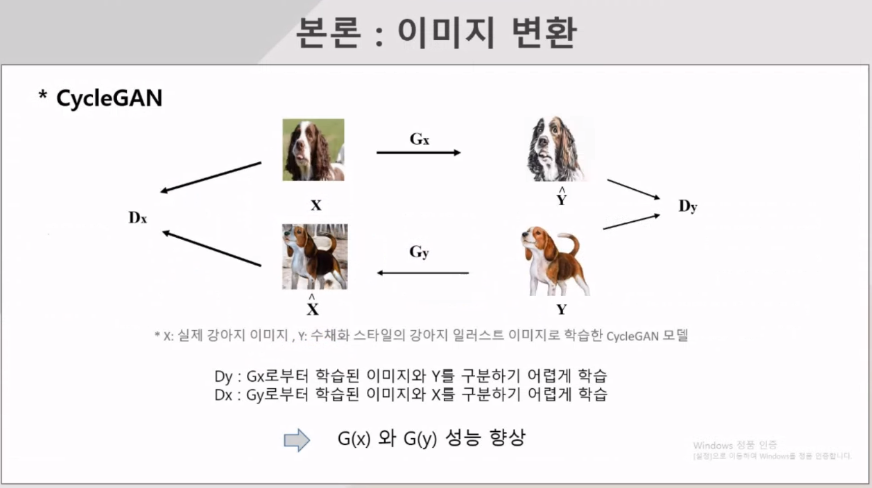
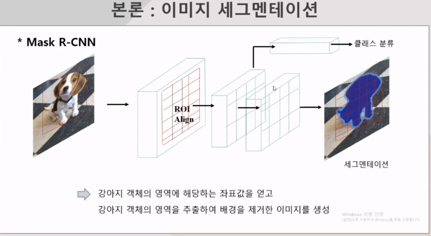
2048개 피쳐사용

공분산값 : C
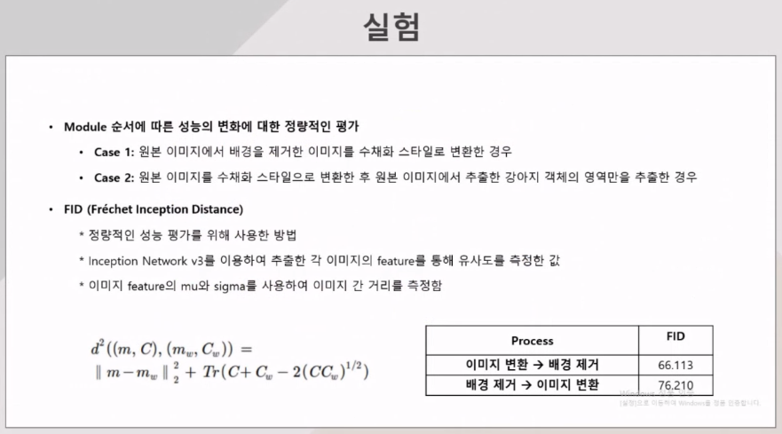

### 화자 인식 발표
화자 인식 개요
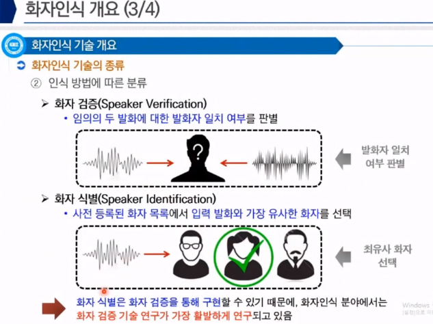
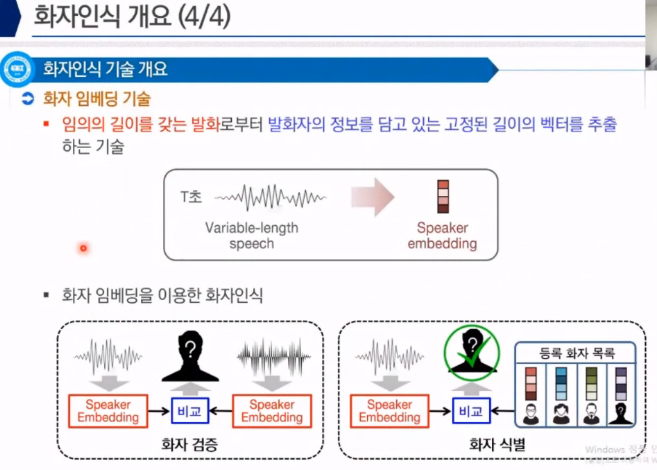
배경
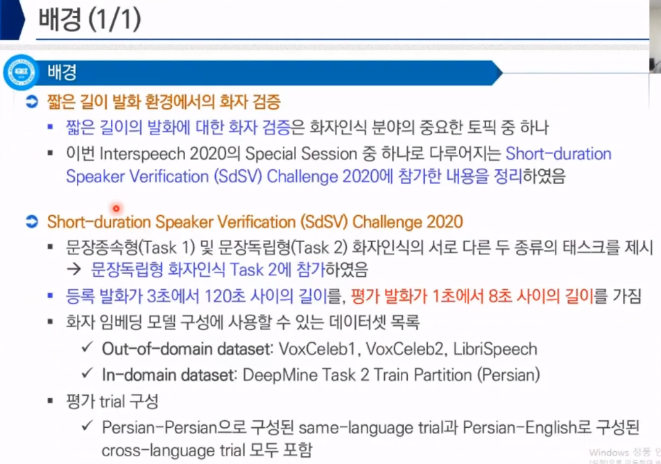
화자 임베딩 모델 설명

1) 중간 레이어에서 데이터 빼는 방법
2) 차원 증가시키고, depth를 임의로 만드는 방법

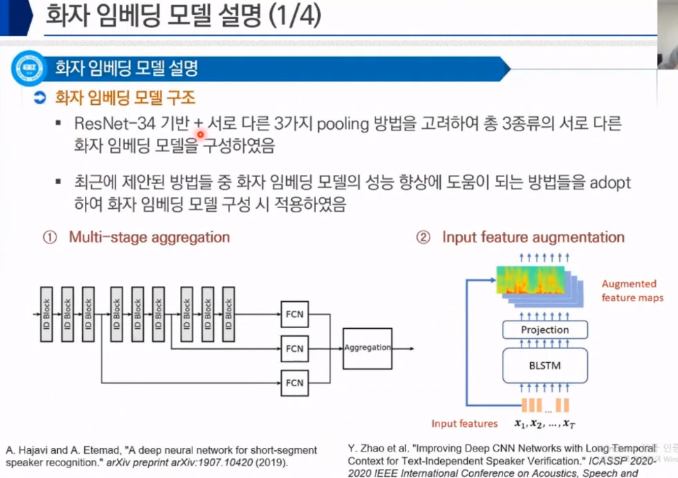

1)
- log mel feature
- AverageFreq > frequency - channel - time domain의 frequency 평균
- weighted average
- 144차원 최종 임베딩으로 사용

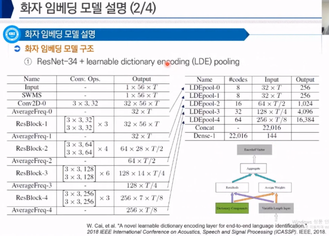

BLSTM 으로 채널을 늘려주고 사용

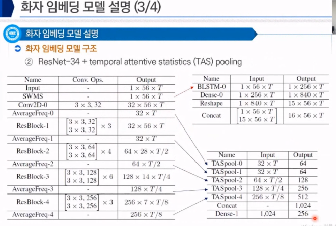

LDEpool 방법

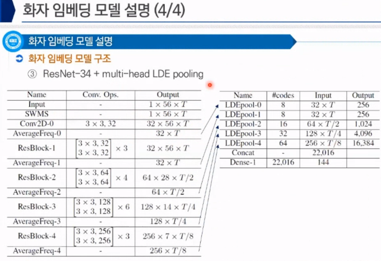

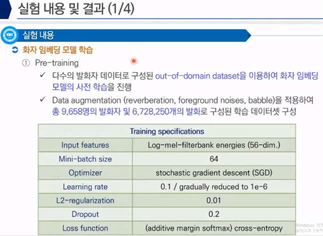

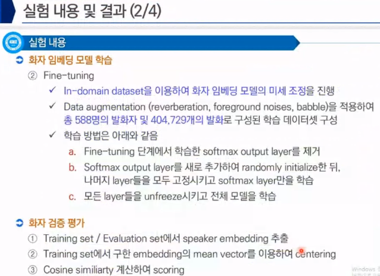

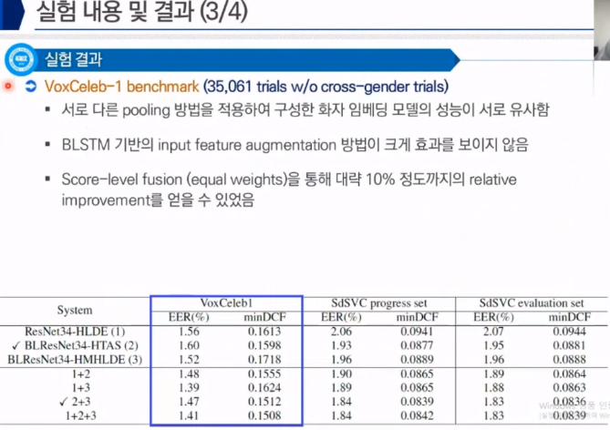

LSTM -> 5%
Score-lave -> 5%

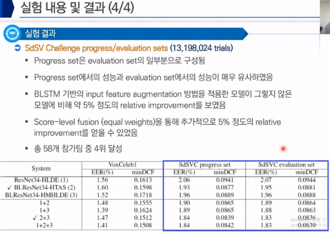

### 효율성과 학습 향상을 위한 양자화된 GAN

생성자와 판별자로 구분

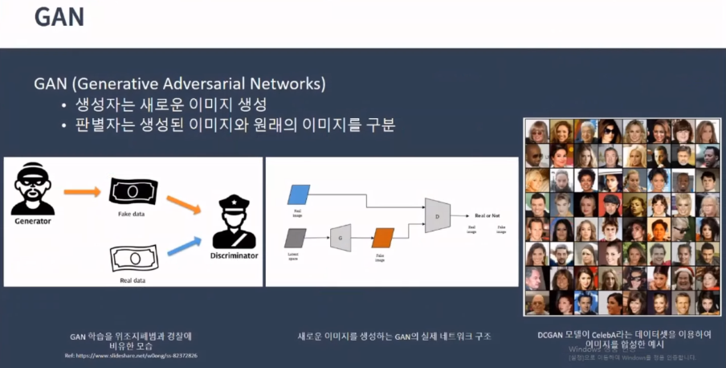

### 퍼지 기반
VQ-VAE
